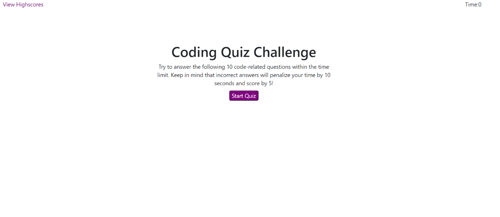

# Code-Quiz

## Contents

* [Introduction](#Introduction)
* [Technologies](#Technologies)
* [Screenshot](#Screenshot)
* [Link](#Link)

## Introduction

The Code Quiz project, ask the user answer 10 question. For each correct answer user will get plus 5 and for each wrong answer user will get minus 5 and 10 seconds will be deducted from the timer.
Once user answer all the question or the time is over then user has to enter its initials and submit. After submit user can view score history.

## Technologies

Project is created with:

* Visual Studio Code 1.51.1

## Screenshot

## Link

[Code Quiz](https://panwaramita.github.io/Code-Quiz/)
